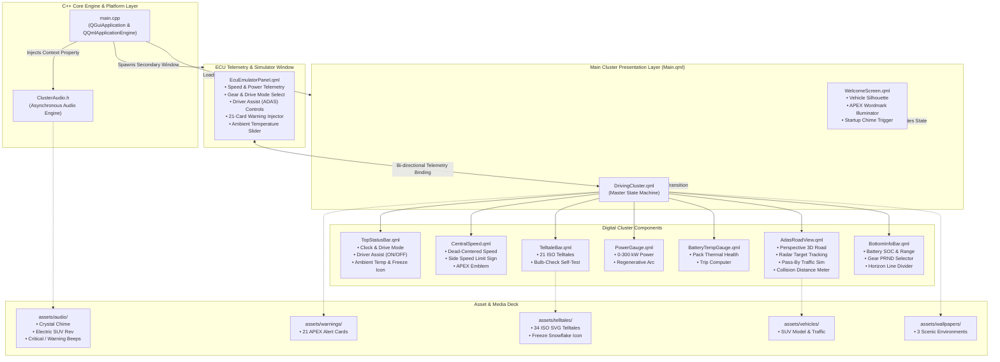
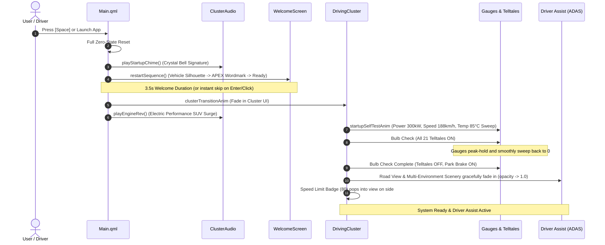

# APEX SUV — Next-Gen EV Digital Instrument Cluster & ECU Simulator

[](https://www.qt.io/)
[](https://isocpp.org/)
[](https://cmake.org/)
[](https://github.com/)
[](LICENSE)

A high-fidelity, luxury **Automotive Digital Instrument Cluster** and interactive **ECU Telemetry Simulator** built with **Qt 6 (QML / Qt Quick)** and **Modern C++**. Features a live perspective 3-lane Highway Driver Assist (ADAS) highway view, authentic high-performance electric vehicle audio soundscape, dynamic multi-environment scenery backgrounds, and a full 21-card OEM automotive warning system.

---

## Preview & Media Showcase

### Application Demo Video


https://github.com/user-attachments/assets/64170b31-a5b3-4ab9-87de-2bc2024274be


### User Interface Screenshots

| Digital Instrument Cluster | Dual-Window ECU Simulator |
|:---:|:---:|
|  |  |

| Driver Assist (ADAS) 3D Highway View | 21-Card OEM Warning System |
|:---:|:---:|
|  |  |

---

## Key Features

### 1. Cinematic Bootup & Acoustic Engine
* **Pure Acoustic Crystal Chime**: Luxury E-Major 9th crystal chime with sub-bass frequency sweep on vehicle wake-up.
* **Electric Performance SUV Motor Soundscape**: High-voltage dual-inverter pre-charge, dual-motor stator torque surge (150 Hz to 1,850 Hz), 12-pole magnetic harmonics, and regenerative deceleration to idle power hum.
* **OEM Gauge Needle Sweeps**: Synchronized startup sweep of Power (0 to 300 kW), Speedometer (0 to 188 km/h), and Battery Temperature (0 to 85°C).
* **Full Spacebar Reboot**: Pressing `Space` at any time instantly reboots the entire system with zero-state resets.

### 2. 3-Lane Highway Driver Assist (ADAS) System
* **Perspective 3D Road Rendering**: Real-time curved road canvas with scrolling dashed lane dividers and lateral ego-vehicle sway.
* **Lead Vehicle Radar & Following Distance**: Real-time target tracking (10m–80m) with HUD distance meter and dynamic obstacle support (Sports Car, Sedan, Hatchback, Motorcycle, Bicycle, Pedestrian).
* **Multi-Lane Traffic Simulation**: Natural left-lane and right-lane overtaking pass-by vehicles with proximity collision detection.
* **Driver Assist Master Toggle**: When disabled, all traffic obstacles and distance HUDs are hidden, and collision warnings are suppressed. Top status shows `DRIVER ASSIST OFF`.
* **Forward Collision Warning**: Triggers persistent visual alert and repeating critical audio alert when lead obstacle is less than 13 meters.

### 3. Complete 21-Card OEM Automotive Warning System
* **Official APEX Warning Cards**: 21 cards covering Brake System, ABS, Motor Overtemp, Battery Fault, High Speed, Low Voltage, Tire Pressure, ADAS Lane Departure, and more.
* **Speed Warning Alerts**:
  * Above 80 km/h: Single warning chime + 2.5s popup card.
  * Above 120 km/h: Persistent dangerous speed card + repeating 2-second chime until speed drops to 120 km/h or below.
* **Ambient Freezing Warning**: White vector snowflake icon automatically illuminates before the temperature readout when ambient temperature drops below 3°C (e.g. `2°C`, `-4°C`).

### 4. Dual-Window ECU Simulator Window
* **Speed, Power & Battery Controls**: Interactive sliders for vehicle speed (0–240 km/h), power output (-50 kW regen to 300 kW boost), battery charge (0–100%), and ambient temperature (-10°C to 45°C).
* **Gear Selector**: P (Park), R (Reverse with parking guidelines), N (Neutral), D (Drive).
* **Drive Modes**: `COMFORT` (Cyan), `SPORT` (Crimson Red), `ECO` (Emerald Green), `OFF-ROAD` (Amber Gold).
* **Scenery Backgrounds**: Mountain Horizon, Cyberpunk City Night, Coastal Sunset.

---

## System Architecture



---

## Bootup & Spacebar Reboot Lifecycle



---

## Keyboard Shortcuts

| Key | Action |
|:---|:---|
| <kbd>Space</kbd> | **Full System Reboot** (Replays Welcome sequence, chimes & sweeps) |
| <kbd>Return</kbd> / <kbd>Enter</kbd> / <kbd>C</kbd> | **Fast-forward** from Welcome Screen directly to Cluster |
| <kbd>D</kbd> | Cycle **Drive Mode** (COMFORT -> SPORT -> ECO -> OFF-ROAD) |
| <kbd>E</kbd> / <kbd>Tab</kbd> | Open / Close **ECU Emulator Panel** |
| <kbd>T</kbd> | Cycle Bulb Check / All Telltale Warning Lights |
| <kbd>Left</kbd> / <kbd>Right</kbd> | Toggle **Left / Right Turn Signal** |

---

## Repository Structure

```
ApexECU_Cluster/
├── CMakeLists.txt              # CMake build configuration with Qt 6 integration
├── Makefile                    # Portable developer convenience commands
├── .gitignore                  # Production Git ignore rules
├── README.md                   # Project documentation
│
├── src/                        # C++ Backend
│   ├── main.cpp                # Application entrypoint & QML engine setup
│   └── ClusterAudio.h          # Non-blocking audio playback engine
│
├── qml/                        # QML / Qt Quick Frontend
│   ├── Main.qml                # Master root container & boot transitions
│   ├── bars/                   # Status & Telltale Bars
│   │   ├── TopStatusBar.qml    # Time, Drive Mode, Driver Assist status & Freeze temp
│   │   ├── BottomInfoBar.qml   # Battery, Range, Gear & Trip telemetry
│   │   └── TelltaleBar.qml     # 21 ISO standard automotive telltales
│   ├── center/                 # Central Gauge Readouts
│   │   ├── CentralSpeed.qml    # Dead-centered speed & side-floating speed limit sign
│   │   └── EcuEmulatorPanel.qml# Dual-window real-time ECU Telemetry Controller
│   ├── gauges/                 # Circular & Arc Gauges
│   │   ├── PowerGauge.qml      # 0-300 kW power / regenerative braking arc
│   │   └── BatteryTempGauge.qml# Battery pack thermal health gauge
│   └── views/                  # Master Viewports
│       ├── WelcomeScreen.qml   # Luxury vehicle silhouette & emblem wake-up
│       ├── DrivingCluster.qml  # Main driving cluster UI & self-test coordinator
│       ├── AdasRoadView.qml    # 3-Lane perspective Driver Assist highway engine
│       └── StarfieldSky.qml    # Ambient celestial background layer
│
└── assets/                     # Organized Asset Tree
    ├── audio/                  # Startup chimes, electric motor sounds & alerts
    ├── branding/               # APEX wordmarks and vehicle emblems
    ├── modes/                  # Drive mode character cards
    ├── telltales/              # 34 ISO telltale SVGs & freeze warning icon
    ├── vehicles/               # APEX SUV top-down models & traffic obstructions
    ├── wallpapers/             # High-resolution scenic environment backgrounds
    └── warnings/               # 21 APEX warning banner cards
```

---

## Build & Run Instructions

### Prerequisites
* **Qt 6.5+** (tested on Qt 6.11) with `QtQuick`, `QtQuick.Controls`
* **CMake 3.20+**
* **C++20** compatible compiler (Clang / GCC / MSVC)
* **Ninja** build system (recommended)

### Quick Start (using Makefile)
```bash
# Clone the repository
git clone https://github.com/skrehanahamed/ApexECU_Cluster.git
cd ApexECU_Cluster

# Build the project
make build

# Launch the Application (Opens Cluster + ECU Emulator)
make run
```

### Manual CMake Build
```bash
mkdir build && cd build
cmake .. -DCMAKE_PREFIX_PATH=/path/to/Qt/6.x.x/macos -GNinja
cmake --build .
./ApexCluster
```

---

## Author & Acknowledgments

* **SK Rehan Ahamed** — [@skrehanahamed](https://github.com/skrehanahamed)

### AI Collaborators & Engineering Credits
Created by **SK Rehan Ahamed** in creative collaboration with **Antigravity**, **Gemini**, and **ChatGPT**.

---

## License
Distributed under the MIT License. See `LICENSE` for more information.

<br/>

<p align="center">
  <sub>Crafted with modern C++ and Qt 6 Quick for automotive digital instrument cluster systems.</sub>
</p>
