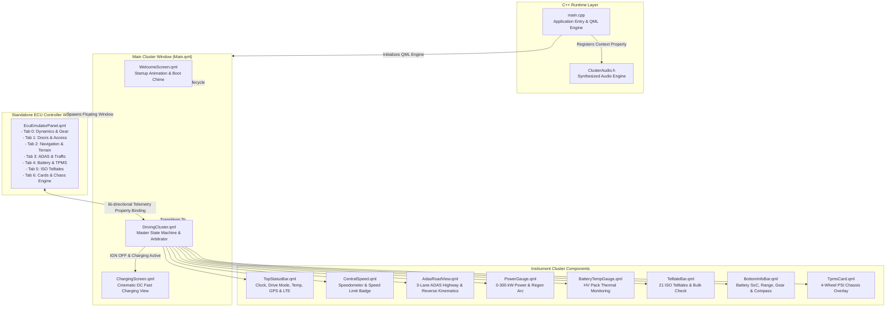
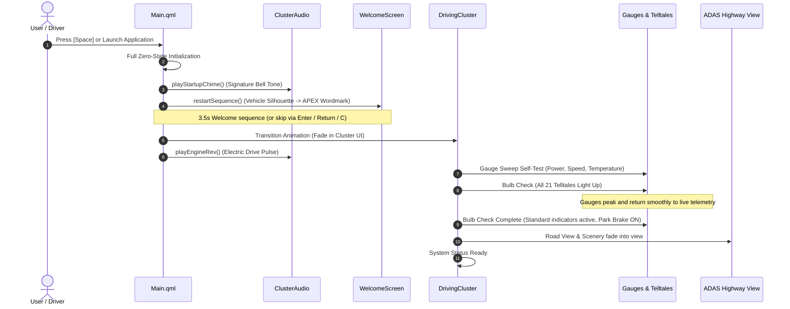

# APEX EV Digital Instrument Cluster & ECU Simulation Suite

[](https://www.qt.io/)
[](https://isocpp.org/)
[](https://cmake.org/)
[](LICENSE)

An ultra-modern, production-grade automotive digital instrument cluster and interactive ECU hardware-in-the-loop (HIL) simulation suite designed for luxury electric vehicles (EV). Built natively using **Qt 6 / QML** and high-performance **C++17**, featuring real-time 3-lane ADAS road perception, full-screen cinematic EV charging, 21 OEM telltales, comprehensive telemetry gauges, 6-door safety interlocks, and synthesized audio chimes.

> **Latest Update (August 30, 2026)**: Major feature release introducing the dedicated standalone multi-tab ECU Telemetry Emulator window, cinematic full-screen EV fast-charging suite, interactive 6-door chassis access safety interlocks, 4-wheel independent TPMS overlay, and synthesized audio engine.

---

## What's New in this Update (Release: August 30, 2026)

### 1. Dedicated Standalone ECU Telemetry Controller Window
* **Detached Multi-Window Architecture**: Decoupled the interactive ECU emulator into an independent auxiliary window (`EcuEmulatorPanel.qml`), accessible via `E` or `Tab`.
* **7-Tab Modular Control Bench**:
  * **Tab 0 (Dynamics)**: Real-time speed slider (0–260 km/h), power output / regenerative braking demand (-100 kW to +300 kW), PRND transmission gear selector, drive mode selector (Comfort, Sport, Eco, Off-Road), speed limit sign presets (80 / 120 km/h), and manual turn indicator triggers.
  * **Tab 1 (Doors & Access)**: 6-point interactive chassis access management (Front Left, Front Right, Rear Left, Rear Right, Bonnet, Trunk) with batch Open/Close All controls and drive safety interlocks.
  * **Tab 2 (Navigation & Terrain)**: Turn-by-turn maneuver triggers (Right, Left, Slight Right, Straight, Roundabout, U-Turn), navigation states (Guiding, Recalculating, Arrived, GPS Lost), street names, ETA countdowns, remaining distance, 16-point compass heading rose, elevation meter, and pitch/roll inclinometer.
  * **Tab 3 (ADAS & Highway Traffic)**: Lead vehicle distance slider, multi-class obstacle selection (SUV, Sedan, Hatchback, Motorcycle, Bicycle, Pedestrian), adjacent lane pass-by traffic toggle, left/right overtaking controls, and blind-spot proximity warning carpets.
  * **Tab 4 (Battery & TPMS)**: High-voltage battery SoC percentage, pack thermal temperature (0°C to 120°C), ambient temperature slider, trip computer telemetry (Trip A, Trip B, Odometer), and 4-wheel independent tire pressure PSI controls with ISO threshold alerts.
  * **Tab 5 (Telltales & Lighting Grid)**: Independent manual toggles for all 21 ISO 7000 indicators including low/high beams, auto high beam assist, fog lamps, 12V auxiliary battery, ABS, ESC, EPB, airbag, check engine, and Neutral gear indicator.
  * **Tab 6 (Cards & Chaos Simulator)**: 22 OEM critical diagnostic warning cards gallery, 1-click automotive presets (*Highway Cruising, Fast DC Charging, Low Battery Alert, Rainy Night, Extreme Winter Freeze, Aggressive Sport Drive*), and an autonomous Chaos Lifecycle Engine that continuously simulates realistic driving cycles.

### 2. Cinematic Full-Screen EV Fast-Charging Suite
* **High-Resolution Charging Scenery**: Dedicated full-screen charging display (`ChargingScreen.qml`) featuring a luxury EV connected to an illuminated DC fast charging station.
* **Live Telemetry & Diagnostics**:
  * **Power Metrics Card**: Live charging rate (kW), dynamic time-to-target countdown (min), and total energy delivered (kWh).
  * **OEM Diagnostic Verification Badges**: Real-time status indicators (*Charging Active, Power Connected, Battery Safe, Fault-Free*).
  * **Battery SoC Glow Indicator**: High-visibility glowing green battery percentage and animated gradient progress bar.
* **State Machine Integration**: Engages upon vehicle ignition shutdown (`IGN OFF` & Goodbye sequence) when charging is active or toggled via the ECU emulator.

### 3. Interactive 6-Door / Hatch Vehicle Access Safety System
* **Chassis Top-View Overlay**: Dynamic visual rendering of door, bonnet, and trunk ajar states with red highlighted graphics.
* **Safety Interlocks & Audio Alarms**: Automated safety interlocks that trigger audible warning chimes when shifting into Drive (`D`) or Reverse (`R`) with any door or hatch open.

### 4. 4-Wheel Independent TPMS Chassis Overlay
* **Dedicated Full-Chassis View (`TpmsCard.qml`)**: Toggleable via `P` key, displaying real-time pressure readouts for all 4 individual tires.
* **Threshold Warning Logic**: Visual color-coded alerts based on standard tire pressure ratings (33 PSI baseline; amber warning at <30 PSI or >38 PSI).
* **Integrated Mini-TPMS**: Compact status readout permanently embedded in the cluster bottom info bar.

### 5. Synthesized Automotive Audio Engine (C++)
* **Native Audio Architecture (`ClusterAudio.h`)**: Non-blocking audio playback supporting startup signatures, drive mode shifts, turn indicator tick-tock rhythms, warning alerts, and critical hazard chimes.

---

## Keyboard Shortcuts & Quick Controls

| Key | Function | Description |
| :--- | :--- | :--- |
| **`Space`** | **Master System Reboot** | Triggers full zero-state reboot and replays the startup sequence, gauge sweeps, and chimes |
| **`Return` / `Enter` / `C`** | **Skip Startup Transition** | Skips the welcome animation directly into the active driving cluster |
| **`D`** | **Cycle Drive Mode** | Cycles through drive modes: `COMFORT` -> `SPORT` -> `ECO` -> `OFF-ROAD` |
| **`O` / `T`** | **Cycle Trip Computer** | Cycles bottom info bar trip modes: `TRIP A` -> `TRIP B` -> `ODO` |
| **`R`** | **Reset Active Trip** | Resets the currently displayed trip odometer counter (`TRIP A` or `TRIP B`) to `0.0 km` |
| **`W`** | **Toggle Warning Cards Test** | Cycles through all 22 OEM critical diagnostic warning cards for cluster testing |
| **`P`** | **Toggle TPMS Chassis Overlay** | Opens / closes the full 4-wheel tire pressure monitoring chassis overlay |
| **`E` / `Tab`** | **Toggle ECU Emulator Window** | Opens / closes the dedicated standalone interactive ECU hardware simulator window |
| **`Left Arrow`** | **Left Turn Signal** | Toggles left turn blinker with synchronized tick-tock audio rhythm |
| **`Right Arrow`** | **Right Turn Signal** | Toggles right turn blinker with synchronized tick-tock audio rhythm |

> **Note**: Vehicle dynamic parameters (speed, power/regen, gear selection, ADAS obstacle distances, battery SoC, tire pressures, and door latches) are controlled in real time via the standalone **ECU Emulator Panel** (`E` / `Tab`).

---

## Core Systems & Feature Overview

### 1. 3-Lane Highway ADAS Road Perception
* **Perspective Road Canvas**: Hardware-accelerated 3D asphalt road with dynamic lane guidance carpet and speed-responsive dashed lines.
* **Multi-Class Vehicle Traffic**: Real-time traffic simulation with distinct obstacle models (*Lead SUV, Sedan, Hatchback, Motorcycle, Bicycle, Pedestrian*).
* **Proximity & Blind Spot Detection**: Real-time distance mapping with amber proximity warnings and glowing red road proximity lines when vehicles overtake in adjacent lanes.
* **Turn-by-Turn Navigation Overlay**: Embedded direction arrows, distance countdown, street names, ETA, and automatic GPS Lost / Recalculation fallback alerts.
* **Kinematic Reverse Simulation (`R`)**: Dynamic rear radar guidance lines with inverted road line kinematics.

### 2. 21 OEM Automotive Telltale Bar
* Turn Signals (Left / Right with synchronized audio tick-tock)
* Seatbelt Warning & Airbag System
* Electronic Stability / Traction Control (ESC)
* Electric Park Brake (EPB)
* Anti-lock Braking System (ABS)
* Malfunction Indicator Lamp (Check Engine)
* 12V Auxiliary Battery Warning
* Tire Pressure Monitoring System (TPMS)
* EV Charging Connector Plug Indicator
* OEM Neutral (`N`) Gear Indicator
* Auto High Beam Assist (A)
* Low Beam & High Beam Headlamps
* Front Fog Lamps
* High-Voltage Battery Thermal Warning
* Master Warning Indicator
* Door / Bonnet / Tailgate Ajar Warning
* Ambient Freeze Warning (Automatic Snowflake icon at <= 3°C)
* **Bulb-Check Self-Test**: Automated lamp verification cycle on cluster initialization.

### 3. Dual Digital Precision Gauges
* **Power Delivery & Regen Gauge (-100 kW to +300 kW)**: Dynamic radial arc displaying real-time kW output and green energy regeneration during deceleration.
* **High-Voltage Battery Temperature Gauge (0°C to 120°C)**: Multi-zone thermal monitoring with automatic warning alerts on overheating (>60°C).
* **Central Speedometer**: Digital speed readout with units, speed limit badges (80 km/h and 120 km/h warnings), and cruise control telemetry.

### 4. Interactive ECU Hardware-in-the-Loop Simulation
* **Full Multi-Subsystem Control**: Real-time manipulation of all vehicular inputs via dedicated sliders and toggles.
* **Automated Chaos Mode**: Built-in algorithmic state generator that simulates realistic urban driving, highway cruising, traffic braking, and thermal cycles automatically.

---

## System Architecture



---

## Bootup & Lifecycle Sequence



---

## Repository Structure

```
ApexECU_Cluster/
├── CMakeLists.txt              # CMake build configuration with Qt 6 QML module setup
├── Makefile                    # Developer shortcuts (make run, make build, make clean)
├── README.md                   # Project documentation
│
├── src/                        # C++ Backend
│   ├── main.cpp                # Application entrypoint & QML engine initialization
│   └── ClusterAudio.h          # Synthesized automotive sound generator
│
├── qml/                        # Qt Quick / QML User Interface
│   ├── Main.qml                # Master root window & keyboard routing
│   │
│   ├── views/                  # Primary Cluster Viewports
│   │   ├── DrivingCluster.qml  # Main driving cluster screen & state machine
│   │   ├── ChargingScreen.qml  # Cinematic full-screen EV fast-charging view
│   │   ├── AdasRoadView.qml    # 3-Lane perspective highway ADAS road canvas
│   │   ├── WelcomeScreen.qml   # Startup welcome animation sequence
│   │   └── StarfieldSky.qml    # Animated starry sky background layer
│   │
│   ├── bars/                   # Standardized Status & Indicator Bars
│   │   ├── TopStatusBar.qml    # Clock, Drive Mode, Temp, GPS & Network telemetry
│   │   ├── TelltaleBar.qml     # 21 OEM automotive telltale indicators
│   │   └── BottomInfoBar.qml   # Battery SoC, Range, Gear selector, Mini-TPMS
│   │
│   ├── gauges/                 # Precision Analog & Digital Instrumentation
│   │   ├── PowerGauge.qml      # Radial Power (kW) & Regen gauge
│   │   └── BatteryTempGauge.qml# Radial Battery Temperature gauge
│   │
│   └── center/                 # Center Stage & Emulation Components
│       ├── CentralSpeed.qml    # Digital speedometer & speed limit sign
│       ├── TpmsCard.qml        # Detailed 4-wheel chassis tire pressure overlay
│       └── EcuEmulatorPanel.qml# Standalone multi-tab ECU simulation control bench
│
└── assets/                     # Packaged Binary & Vector Assets
    ├── audio/                  # Startup chimes, motor sounds, and alert tones
    ├── branding/               # APEX wordmarks and vehicle emblems
    ├── fonts/                  # Inter variable typography
    ├── modes/                  # Drive mode graphic cards (Comfort, Sport, Eco, Off-Road)
    ├── navigation/             # Turn-by-turn guidance SVGs
    ├── telltales/              # 21+ ISO vector SVGs (active/inactive states)
    ├── vehicles/               # SUV top-views, chassis diagrams, traffic vehicle models
    ├── wallpapers/             # Scenic environment backgrounds & charging backdrop
    └── warnings/               # 22 OEM safety warning alert popup cards
```

---

## Getting Started

### Prerequisites
* **macOS / Linux / Windows**
* **Qt 6.5+** (tested on Qt 6.11) with `QtQuick`, `QtQuick.Controls`, `QtGui`, `QtCore`
* **CMake 3.20+**
* **Clang** or **GCC** supporting C++17

### Build & Run

1. **Clone the repository**:
   ```bash
   git clone https://github.com/skrehanahamed/ApexECU_Cluster.git
   cd ApexECU_Cluster
   ```

2. **Run using Makefile** (Recommended):
   ```bash
   # Build the executable
   make build

   # Launch the cluster and ECU emulator
   make run
   ```

3. **Or build with CMake manually**:
   ```bash
   mkdir build && cd build
   cmake ..
   cmake --build .
   ./ApexCluster.app/Contents/MacOS/ApexCluster   # macOS
   # or ./ApexCluster                             # Linux/Windows
   ```

---

## Author & Acknowledgments

* **SK Rehan Ahamed** — [@skrehanahamed](https://github.com/skrehanahamed)

### AI Collaborators & Engineering Credits
Created by **SK Rehan Ahamed** in collaboration with **Antigravity**, **Gemini**, and **ChatGPT**.

---

## License

This project is licensed under the MIT License — see the [LICENSE](LICENSE) file for details.
