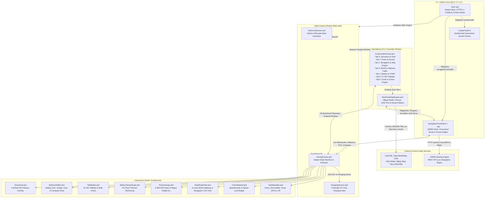
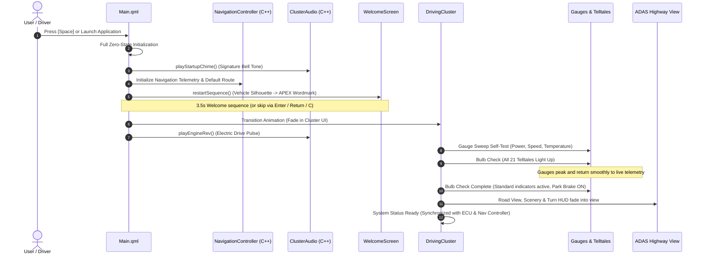

# APEX EV Digital Instrument Cluster & ECU Simulation Suite

[](https://github.com/skrehanahamed/ApexECU_Cluster/actions/workflows/build.yml)
[](https://github.com/skrehanahamed/ApexECU_Cluster/releases)
[](https://www.qt.io/)
[](https://isocpp.org/)
[](https://cmake.org/)
[](https://github.com/)
[](LICENSE)

An ultra-modern, production-grade automotive digital instrument cluster and interactive ECU hardware-in-the-loop (HIL) simulation suite designed for luxury electric vehicles (EV). Built natively using **Qt 6 / QML** and high-performance **C++17**, featuring real-time 3-lane ADAS road perception, full-screen cinematic EV charging, 21 OEM telltales, comprehensive telemetry gauges, 6-door safety interlocks, synthesized audio chimes, and an interactive real-time map navigation engine with native C++ telemetry synchronization.

> **Latest Release (v1.2.1 - September 2026)**: Multi-platform CI release adding native Windows MSVC compilation, automated binary & dynamic linkage verification, static QML linting (`qmllint`), and automated build artifact publishing alongside the Real-Time Navigation Controller and Map Engine.

---

## Preview & Media Showcase

### Application Demo Video

https://github.com/user-attachments/assets/64170b31-a5b3-4ab9-87de-2bc2024274be

### User Interface Screenshots

| Digital Instrument Cluster | Dual-Window ECU Simulator |
|:---:|:---:|
|  |  |

| Driver Assist (ADAS) 3D Highway View | 21-Card OEM Warning System |
|:---:|:---:|
|  |  |

---

## Release History & Version Changelog

### Version 1.2.1 (Release: September 4, 2026)

> **Cross-Platform Enterprise CI & Automated Release Infrastructure**: Introduces comprehensive multi-platform automation covering native Windows MSVC compilation, Linux build namespace isolation, backwards-compatible Qt policy guards, automated static QML linting suites, and end-to-end GitHub Release asset publishing.

#### Platform Support & Build Matrix

| Platform | Runner | Compiler & Toolchain | Output Package | CI Verification Status |
|:---|:---|:---|:---|:---:|
| **macOS** (14 Sonoma / 15 Sequoia) | `macos-latest` | Apple Clang (C++17) + Ninja | `ApexCluster-macOS.zip` (`.app` bundle) | []() |
| **Ubuntu Linux** (22.04 / 24.04 LTS) | `ubuntu-latest` | GCC 13 (C++17) + Ninja | `ApexCluster-Linux.tar.gz` (ELF binary) | []() |
| **Windows** (10 / 11 64-bit) | `windows-latest` | MSVC 2022 (v19.43) + Ninja | `ApexCluster-Windows.zip` (`.exe` binary) | []() |

#### Key Technical Advancements in v1.2.1

#### 1. Native Windows CI Pipeline (`build-windows`)
* **MSVC 2022 & Ninja Integration**: Automated Microsoft Visual C++ environment initialization via `ilammy/msvc-dev-cmd` paired with Ninja parallel build generation for rapid compilation times.
* **Qt 6.7+ MSVC Provisioning**: Automated provisioning of Qt 6.7.3 desktop runtime (`win64_msvc2019_64`) via `jurplel/install-qt-action` with full support for Core, GUI, Quick, and Network modules.
* **PowerShell Verification**: Automated verification verifying binary generation (`Test-Path build/ApexCluster.exe`) and packaging into ready-to-run release archives.

#### 2. Linux Build Namespace Isolation (`CMakeLists.txt`)
* **QML Module Target Collision Fix**: Resolved the classic Linux linker collision where target `ApexCluster` and module URI `ApexCluster` competed for the same filesystem directory path (`/usr/bin/ld: cannot open output file ApexCluster: Is a directory`).
* **Dedicated Module Tree**: Routed generated QML module artifacts, type registrations, and plugins into `build/qml_modules/ApexCluster/` via `OUTPUT_DIRECTORY`, allowing clean top-level Linux binary output at `build/ApexCluster`.

#### 3. Backward-Compatible Qt Policy Management
* **Qt 6.8+ Forward Policy Guard**: Guarded `qt_policy(SET QTP0004 NEW)` behind `if(Qt6_VERSION VERSION_GREATER_EQUAL "6.8.0")` conditionals, ensuring the codebase builds without warning or error across both modern rolling Qt versions (Qt 6.8 / 6.11) and enterprise long-term support releases (Qt 6.5 / 6.7 LTS).

#### 4. Automated Static QML Validation (`qmllint`)
* **Official Qt Linter Pipeline**: Integrated `qmllint` across master UI modules (`Main.qml`, `DrivingCluster.qml`, `RealTimeMapEngine.qml`) during every commit and pull request.
* **C++ Context Property Filter Engine**: Configured custom filter rules (`--unqualified disable --unused-imports disable`) to eliminate false-positive warnings from dynamically injected C++ context properties (`navigationController`, `clusterAudio`) while rigorously validating UI syntax, geometry layouts, and element bindings.

#### 5. Automated GitHub Release Publishing (`.github/workflows/release.yml`)
* **One-Click Release Workflow**: Added GitHub Actions release publishing triggered automatically by version tags (`v*`) or manual dispatch.
* **Multi-Platform Asset Aggregation**: Compiles and bundles native packages across macOS, Linux, and Windows, uploading them directly to the GitHub Releases page with automated changelog generation.

---

### Version 1.2.0 (Release: September 4, 2026)

#### 1. Interactive Automotive Map Engine (`RealTimeMapEngine.qml`)
* **Dark CartoDB / OSM Slippy Map Canvas**: High-performance slippy map canvas using dark raster tiles with mathematical Spherical Mercator projection coordinate mapping (`lat/lon` ➔ tile indices).
* **Interactive Viewport Controls**: Smooth touch/mouse pan gestures, step zoom controls (`+` / `-`), auto-centering on vehicle, and zoom-to-fit bounding box calculation.
* **Click-to-Pin Waypoints**: Interactive pin placement mode (`Set Start` & `Set Dest`) allowing drivers/testers to drop arbitrary origin and destination pins anywhere on the world map.
* **5 Global Pre-Configured Route Presets**: Instant one-click route loading for major testing hubs: *Bengaluru (MG Road to Outer Ring Road)*, *San Francisco (Market St to Golden Gate)*, *Tokyo (Shibuya to Ginza)*, *London (Westminster to Canary Wharf)*, and the legendary *Nürburgring Nordschleife*.
* **Live Route Polyline & Marker Animation**: Smooth visual rendering of route polyline path segments and animated directional vehicle marker with real-time heading rotation.

#### 2. Native C++ Real-Time Navigation Controller (`NavigationController.h` / `NavigationController.cpp`)
* **Live OSRM Routing Engine**: Asynchronous HTTP networking powered by `QNetworkAccessManager` that queries the Open Source Routing Machine (OSRM) REST API to generate turn-by-turn maneuvers, geometry coordinates, and road step summaries.
* **Procedural Offline Route Fallback**: Built-in procedural route generator with smooth multi-waypoint interpolation ensuring seamless offline testing without network connectivity.
* **Auto-Drive Cruise Simulation**: Autonomous cruise driving simulator with variable speed multipliers (`1x`, `2x`, `5x`, `10x`), route scrubber progress slider (`0%` to `100%`), and real-time throttle calculation.
* **GPS Signal Blackout Simulation**: Simulate tunnel driving and urban canyons with a single toggle (`GPS_LOST`), automatically streaming caution indicators to the instrument cluster.

#### 3. Cluster HUD Telemetry Streaming & Arrival Audio Alerts
* **Bi-Directional Telemetry Sync**: Synchronizes maneuver instructions (`turn_left`, `turn_right`, `roundabout`, `fork`, `u_turn`, `straight`), distance countdowns (`850 m` ➔ `400 m` ➔ `Now`), street names, remaining kilometers, ETA, and 16-point dynamic compass bearings (`N`, `NE`, `E`, `SE`, `S`, `SW`, `W`, `NW`) directly into the digital cluster HUD.
* **Speedometer Sync**: Option to automatically drive the cluster digital speedometer and power gauges based on simulated cruise navigation speed.
* **Destination Arrival Audio**: Automatically triggers audio warning chimes via `ClusterAudio` when reaching the trip destination.

#### 4. Automated Multi-Platform GitHub Actions CI
* **Cross-Platform Verification**: GitHub Actions workflow (`.github/workflows/build.yml`) continuously compiling and testing `ApexCluster` on **macOS (macOS Latest / Apple Clang)** and **Linux (Ubuntu Latest / GCC 64)** with Qt 6.7+.

---

### Version 1.1.0 (Release: August 30, 2026)

#### 1. Dedicated Standalone ECU Telemetry Controller Window
* **Detached Multi-Window Architecture**: Decoupled the interactive ECU emulator into an independent auxiliary window (`EcuEmulatorPanel.qml`), accessible via `E` or `Tab`.
* **7-Tab Modular Control Bench**:
  * **Tab 0 (Dynamics)**: Real-time speed slider (0–260 km/h), power output / regenerative braking demand (-100 kW to +300 kW), PRND transmission gear selector, drive mode selector (Comfort, Sport, Eco, Off-Road), speed limit sign presets (80 / 120 km/h), and manual turn indicator triggers.
  * **Tab 1 (Doors & Access)**: 6-point interactive chassis access management (Front Left, Front Right, Rear Left, Rear Right, Bonnet, Trunk) with batch Open/Close All controls and drive safety interlocks.
  * **Tab 2 (Navigation & Real-Time Map Simulator)**: Sub-Tab 0 for interactive real-time map engine & routing simulator; Sub-Tab 1 for manual maneuver overrides, compass heading picker, elevation altitude slider (0 to 3500 m), and off-road pitch/roll inclinometer.
  * **Tab 3 (ADAS & Highway Traffic)**: Lead vehicle distance slider, multi-class obstacle selection (SUV, Sedan, Hatchback, Motorcycle, Bicycle, Pedestrian), adjacent lane pass-by traffic toggle, left/right overtaking controls, and blind-spot proximity warning carpets.
  * **Tab 4 (Battery & TPMS)**: High-voltage battery SoC percentage, pack thermal temperature (0°C to 120°C), ambient temperature slider, trip computer telemetry (Trip A, Trip B, Odometer), and 4-wheel independent tire pressure PSI controls with ISO threshold alerts.
  * **Tab 5 (Telltales & Lighting Grid)**: Independent manual toggles for all 21 ISO 7000 indicators including low/high beams, auto high beam assist, fog lamps, 12V auxiliary battery, ABS, ESC, EPB, airbag, check engine, and Neutral gear indicator.
  * **Tab 6 (Cards & Chaos Simulator)**: 22 OEM critical diagnostic warning cards gallery, 1-click automotive presets (*Highway Cruising, Fast DC Charging, Low Battery Alert, Rainy Night, Extreme Winter Freeze, Aggressive Sport Drive*), and an autonomous Chaos Lifecycle Engine that continuously simulates realistic driving cycles.

#### 2. Cinematic Full-Screen EV Fast-Charging Suite
* **High-Resolution Charging Scenery**: Dedicated full-screen charging display (`ChargingScreen.qml`) featuring a luxury EV connected to an illuminated DC fast charging station.
* **Live Telemetry & Diagnostics**: Live charging rate (kW), dynamic time-to-target countdown (min), and total energy delivered (kWh), plus OEM status verification badges.

#### 3. Interactive 6-Door / Hatch Vehicle Access Safety System
* **Chassis Top-View Overlay**: Dynamic visual rendering of door, bonnet, and trunk ajar states with red highlighted graphics and automated Drive (`D`) / Reverse (`R`) safety interlocks with audible alarms.

#### 4. 4-Wheel Independent TPMS Chassis Overlay
* **Dedicated Full-Chassis View (`TpmsCard.qml`)**: Toggleable via `P` key, displaying real-time pressure readouts for all 4 individual tires with threshold warning logic.

#### 5. Synthesized Automotive Audio Engine (C++)
* **Native Audio Architecture (`ClusterAudio.h`)**: Non-blocking audio playback supporting startup signatures, drive mode shifts, turn indicator tick-tock rhythms, warning alerts, and critical hazard chimes.

---

### Version 1.0.0 (Release: August 29, 2026) - Initial Production Launch

#### 1. Core Digital Instrument Cluster & State Engine
* **High-Performance UI Framework**: Built natively with Qt 6 / QML 60 FPS hardware-accelerated rendering and C++17 core foundations.
* **Cinematic Startup & Zero-State Reboot**: Multi-phase vehicle silhouette welcome animation (`WelcomeScreen.qml`, `StarfieldSky.qml`), gauge sweeps, bulb-check sequence, and instant transition skips (`Space`, `Enter`, `Return`, `C`).

#### 2. 3-Lane Perspective Highway ADAS Perception
* **Perspective Road Canvas (`AdasRoadView.qml`)**: Dynamic 3D highway perspective with speed-responsive dashed lane markings and guidance carpet.
* **Traffic Obstacle Detection**: Real-time rendering of lead vehicles and multi-class traffic models (*SUV, Sedan, Hatchback, Motorcycle, Bicycle, Pedestrian*).
* **Blind-Spot & Proximity Warnings**: Amber distance caution zones and glowing red carpet alerts for passing vehicles in adjacent lanes.
* **Kinematic Reverse Simulation (`R`)**: Dynamic rear radar guidance lines with inverted road line kinematics.

#### 3. Dual Radial Instrumentation & Speedometer
* **Power Arc Gauge (`PowerGauge.qml`)**: Real-time radial arc monitoring power draw (0 to 300 kW) and regenerative braking (-100 to 0 kW).
* **Battery Pack Thermal Gauge (`BatteryTempGauge.qml`)**: High-voltage battery pack thermal monitoring (0°C to 120°C) with overheat alarm thresholds.
* **Central Digital Speedometer (`CentralSpeed.qml`)**: Large format digital speed readout with speed limit sign badge presets (80 / 120 km/h).

#### 4. 21 OEM ISO 7000 Automotive Telltales
* Full complement of 21 ISO standard automotive telltales with automated bulb-check self-test routines on ignition.

#### 5. Standardized Cluster Telemetry Bars
* **Top Status Bar (`TopStatusBar.qml`)**: Live digital clock, drive modes (`COMFORT`, `SPORT`, `ECO`, `OFF-ROAD`), ambient temperature, cellular LTE signal, and GPS indicators.
* **Bottom Info Bar (`BottomInfoBar.qml`)**: High-voltage battery SoC %, remaining estimated range (km), PRND transmission gear selector, 16-point compass rose, and multi-mode trip computer (`TRIP A`, `TRIP B`, `ODO`).

---

## Keyboard Shortcuts & Quick Controls

| Key | Function | Description |
| :--- | :--- | :--- |
| **`Space`** | **Master System Reboot** | Triggers full zero-state reboot and replays the startup sequence, gauge sweeps, and chimes |
| **`Return` / `Enter` / `C`** | **Skip Startup Transition** | Skips the welcome animation directly into the active driving cluster |
| **`D`** | **Cycle Drive Mode** | Cycles through drive modes: `COMFORT` -> `SPORT` -> `ECO` -> `OFF-ROAD` |
| **`O` / `T`** | **Cycle Trip Computer** | Cycles bottom info bar trip modes: `TRIP A` -> `TRIP B` -> `ODO` |
| **`R`** | **Reset Active Trip** | Resets the currently displayed trip odometer counter (`TRIP A` or `TRIP B`) to `0.0 km` |
| **`W`** | **Toggle Warning Cards Test** | Cycles through all 22 OEM critical diagnostic warning cards for cluster testing |
| **`P`** | **Toggle TPMS Chassis Overlay** | Opens / closes the full 4-wheel tire pressure monitoring chassis overlay |
| **`E` / `Tab`** | **Toggle ECU Emulator Window** | Opens / closes the dedicated standalone interactive ECU hardware simulator window |
| **`Left Arrow`** | **Left Turn Signal** | Toggles left turn blinker with synchronized tick-tock audio rhythm |
| **`Right Arrow`** | **Right Turn Signal** | Toggles right turn blinker with synchronized tick-tock audio rhythm |

> **Note**: Vehicle dynamic parameters (speed, power/regen, gear selection, ADAS obstacle distances, battery SoC, tire pressures, and door latches) are controlled in real time via the standalone **ECU Emulator Panel** (`E` / `Tab`).

---

## Core Systems & Feature Overview

### 1. 3-Lane Highway ADAS Road Perception
* **Perspective Road Canvas**: Hardware-accelerated 3D asphalt road with dynamic lane guidance carpet and speed-responsive dashed lines.
* **Multi-Class Vehicle Traffic**: Real-time traffic simulation with distinct obstacle models (*Lead SUV, Sedan, Hatchback, Motorcycle, Bicycle, Pedestrian*).
* **Proximity & Blind Spot Detection**: Real-time distance mapping with amber proximity warnings and glowing red road proximity lines when vehicles overtake in adjacent lanes.
* **Turn-by-Turn Navigation Overlay**: Embedded direction arrows, distance countdown, street names, ETA, and automatic GPS Lost / Recalculation fallback alerts.
* **Kinematic Reverse Simulation (`R`)**: Dynamic rear radar guidance lines with inverted road line kinematics.

### 2. 21 OEM Automotive Telltale Bar
* Turn Signals (Left / Right with synchronized audio tick-tock)
* Seatbelt Warning & Airbag System
* Electronic Stability / Traction Control (ESC)
* Electric Park Brake (EPB)
* Anti-lock Braking System (ABS)
* Malfunction Indicator Lamp (Check Engine)
* 12V Auxiliary Battery Warning
* Tire Pressure Monitoring System (TPMS)
* EV Charging Connector Plug Indicator
* OEM Neutral (`N`) Gear Indicator
* Auto High Beam Assist (A)
* Low Beam & High Beam Headlamps
* Front Fog Lamps
* High-Voltage Battery Thermal Warning
* Master Warning Indicator
* Door / Bonnet / Tailgate Ajar Warning
* Ambient Freeze Warning (Automatic Snowflake icon at <= 3°C)
* **Bulb-Check Self-Test**: Automated lamp verification cycle on cluster initialization.

### 3. Dual Digital Precision Gauges
* **Power Delivery & Regen Gauge (-100 kW to +300 kW)**: Dynamic radial arc displaying real-time kW output and green energy regeneration during deceleration.
* **High-Voltage Battery Temperature Gauge (0°C to 120°C)**: Multi-zone thermal monitoring with automatic warning alerts on overheating (>60°C).
* **Central Speedometer**: Digital speed readout with units, speed limit badges (80 km/h and 120 km/h warnings), and cruise control telemetry.

### 4. Interactive ECU Hardware-in-the-Loop Simulation
* **Full Multi-Subsystem Control**: Real-time manipulation of all vehicular inputs via dedicated sliders and toggles across 7 modular benches.
* **Automated Chaos Mode**: Built-in algorithmic state generator that simulates realistic urban driving, highway cruising, traffic braking, and thermal cycles automatically.

### 5. Native Real-Time Map & Turn-by-Turn Navigation Engine
* **Interactive Slippy Raster Canvas**: Dark CartoDB / OSM map canvas with mathematical Spherical Mercator projection, supporting smooth touch/mouse panning, step zoom (`+` / `-`), vehicle centering, and route bounding-box auto-fit.
* **C++ Live OSRM Routing Engine**: Asynchronous HTTP client (`QNetworkAccessManager`) querying the Open Source Routing Machine REST API for real-world driving steps, street names, maneuvers, and road geometries.
* **Offline Procedural Route Generator**: Built-in algorithmic fallback that generates multi-waypoint routes with smooth spherical interpolation when disconnected from the internet.
* **Real-Time Autonomous Cruise Simulation**: Cruise simulation with configurable speed multipliers (`1x`, `2x`, `5x`, `10x`), route scrubber progress slider (`0%` to `100%`), speed sync with the digital speedometer, and tunnel `GPS_LOST` blackout testing.
* **5 Global Pre-Configured Presets**: Instant one-click route simulation for *Bengaluru*, *San Francisco*, *Tokyo*, *London*, and the *Nürburgring Nordschleife*.
* **Bi-Directional Cluster Synchronization**: Real-time streaming of maneuver arrows, distance countdowns (`850 m` ➔ `400 m` ➔ `Now`), street names, remaining km, ETA, 16-point dynamic compass bearings, and arrival chimes directly into the cluster HUD.

---

## System Architecture



---

## Bootup & Lifecycle Sequence



---

## Repository Structure

```
ApexECU_Cluster/
├── .github/
│   └── workflows/
│       └── build.yml           # Multi-platform CI pipeline (macOS & Ubuntu Linux)
├── CMakeLists.txt              # CMake build configuration with Qt 6 QML module setup
├── Makefile                    # Developer shortcuts (make run, make build, make clean)
├── README.md                   # Comprehensive project documentation & architecture
│
├── src/                        # C++ Backend
│   ├── main.cpp                # Application entrypoint & QML engine initialization
│   ├── ClusterAudio.h          # Synthesized automotive sound generator
│   ├── NavigationController.h  # Native C++ Navigation & GPS Controller header
│   └── NavigationController.cpp# Live OSRM routing & simulation engine
│
├── qml/                        # Qt Quick / QML User Interface
│   ├── Main.qml                # Master root window & keyboard routing
│   │
│   ├── views/                  # Primary Cluster Viewports
│   │   ├── DrivingCluster.qml  # Main driving cluster screen & state machine
│   │   ├── ChargingScreen.qml  # Cinematic full-screen EV fast-charging view
│   │   ├── AdasRoadView.qml    # 3-Lane perspective highway ADAS road canvas
│   │   ├── WelcomeScreen.qml   # Startup welcome animation sequence
│   │   └── StarfieldSky.qml    # Animated starry sky background layer
│   │
│   ├── bars/                   # Standardized Status & Indicator Bars
│   │   ├── TopStatusBar.qml    # Clock, Drive Mode, Temp, GPS & Network telemetry
│   │   ├── TelltaleBar.qml     # 21 OEM automotive telltale indicators
│   │   └── BottomInfoBar.qml   # Battery SoC, Range, Gear selector, Mini-TPMS
│   │
│   ├── gauges/                 # Precision Analog & Digital Instrumentation
│   │   ├── PowerGauge.qml      # Radial Power (kW) & Regen gauge
│   │   └── BatteryTempGauge.qml# Radial Battery Temperature gauge
│   │
│   └── center/                 # Center Stage & Emulation Components
│       ├── CentralSpeed.qml    # Digital speedometer & speed limit sign
│       ├── TpmsCard.qml        # Detailed 4-wheel chassis tire pressure overlay
│       ├── EcuEmulatorPanel.qml# Standalone multi-tab ECU simulation control bench
│       └── RealTimeMapEngine.qml# Interactive dark slippy map canvas & route visualizer
│
└── assets/                     # Packaged Binary & Vector Assets
    ├── audio/                  # Startup chimes, motor sounds, and alert tones
    ├── branding/               # APEX wordmarks and vehicle emblems
    ├── fonts/                  # Inter variable typography
    ├── modes/                  # Drive mode graphic cards (Comfort, Sport, Eco, Off-Road)
    ├── navigation/             # Turn-by-turn guidance SVGs
    ├── telltales/              # 21+ ISO vector SVGs (active/inactive states)
    ├── vehicles/               # SUV top-views, chassis diagrams, traffic vehicle models
    ├── wallpapers/             # Scenic environment backgrounds & charging backdrop
    └── warnings/               # 22 OEM safety warning alert popup cards
```

---

## Getting Started

### Prerequisites
* **macOS / Linux / Windows**
* **Qt 6.5+** (tested on Qt 6.11) with `QtQuick`, `QtQuick.Controls`, `QtGui`, `QtCore`, `QtNetwork`
* **CMake 3.20+**
* **Clang** or **GCC** supporting C++17

### Build & Run

1. **Clone the repository**:
   ```bash
   git clone https://github.com/skrehanahamed/ApexECU_Cluster.git
   cd ApexECU_Cluster
   ```

2. **Run using Makefile** (Recommended):
   ```bash
   # Build the executable
   make build

   # Launch the cluster and ECU emulator
   make run
   ```

3. **Or build with CMake manually**:
   ```bash
   mkdir build && cd build
   cmake ..
   cmake --build .
   ./ApexCluster.app/Contents/MacOS/ApexCluster   # macOS
   # or ./ApexCluster                             # Linux/Windows
   ```

---

## Author & Acknowledgments

* **SK Rehan Ahamed** — [@skrehanahamed](https://github.com/skrehanahamed)

### AI Collaborators & Engineering Credits
Created by **SK Rehan Ahamed** in collaboration with **Antigravity**, **Gemini**, and **ChatGPT**.

---

## License

This project is licensed under the MIT License — see the [LICENSE](LICENSE) file for details.
